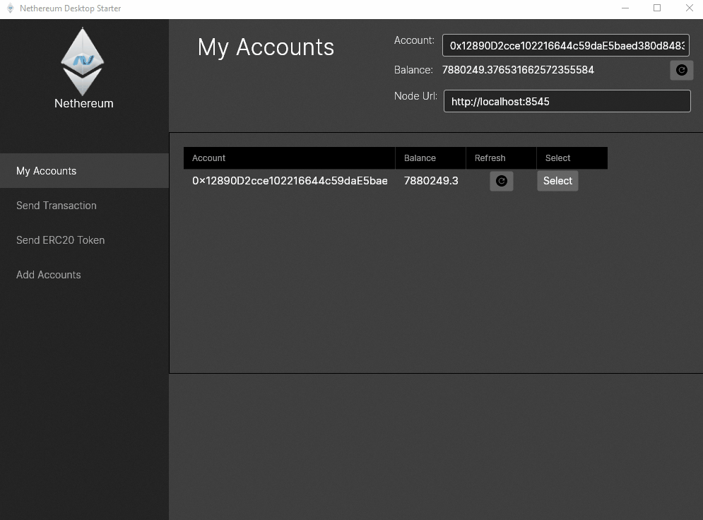

# Nethereum UI Desktop Starter Template

Functional sample of a Reactive Cross platform desktop wallet connecting to Ethereum using Nethereum, Avalonia and ReactiveUI. 

The aim of the starter kit is to provide a continous improving shell allowing to focus only on the developing the specific screens that provide the integration with smart contracts.

The main example for this is the Standard Token component which provides the desktop views and view models (that can be reused later on with Xamarin Forms, Blazor or Uno)

## Screenshots

